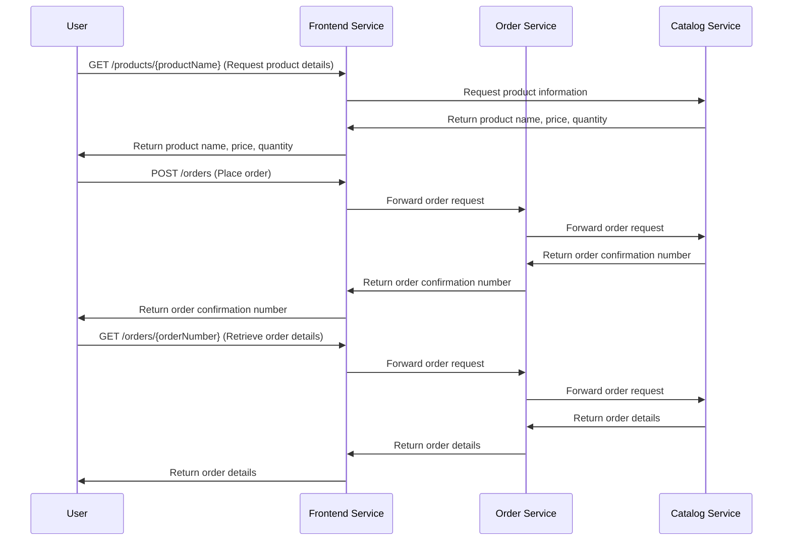

# Store Inventory Management System

This project implements a **microservices-based store inventory system** that enables users to browse and purchase products.

## 🏗️ Tech Stack

## 📜 Microservices Overview
- **Frontend Service**: Serves as the interface for the entire microservices architecture, handling user interactions and API requests.
- **Catalog Service**: Interacts with a MySQL database to retrieve product details and process order data. It also schedules a task to restock out-of-stock products every 10 seconds.
- **Order Service**: Handles order placement and retrieval by forwarding requests to the Catalog Service and returning the response to the Frontend Service.
  
## 📡 API Flow
This section provides an overview of the interaction between the **User**, **Frontend Service**, **Order Service**, and **Catalog Service** in the application.

